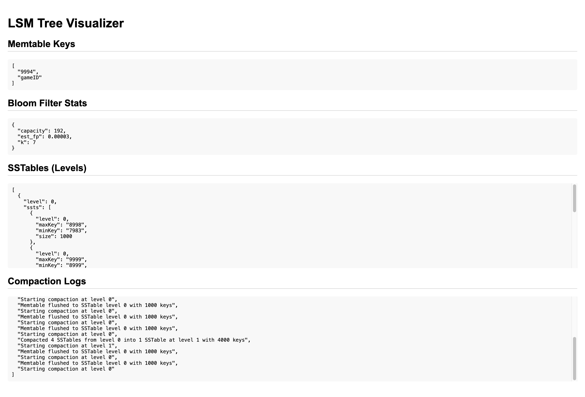

# 📊 LSM Tree Visualizer

A simple LSM Tree implementation in Go with:

- 🧠 In-memory **Memtable**
- 🔍 **Bloom Filters** for existence checks
- 💾 **SSTables** written to disk
- 🔄 **Levelled Compaction** across SSTables
- 🌐 **HTTP API** for data access
- 🖥️ **UI for visualization** of LSM internals

> I built this to understand how real-world time-series databases or key-value stores implement LSM Trees.

---

## 🚀 Features

✅ Put/Get key-value pairs via HTTP  
✅ Visualize Memtable, Bloom Filter, SSTables, and Compaction Logs  
✅ Observe SSTable flushing and compaction as they happen  
✅ Persistent SSTable storage on disk  
✅ Configurable Memtable and Bloom filter sizes  
✅ Auto-refresh UI for live updates  

---

## 🛠️ Getting Started

### 1. Clone the repo

```bash
git clone git@github.com:SwatiModi/lsm-visualizer.git
cd lsm-tree-visualizer
```

### 2. Build and Run

```bash
go mod tidy
go run main.go
```

The server will start at: [http://localhost:8080](http://localhost:8080)

---

## 📦 Usage

### Insert a Key

```bash
curl -X POST http://localhost:8080/put   -H "Content-Type: application/json"   -d '{"key":"model", "value":"iphone-11-se"}'
```

### Fetch a Key

```bash
curl "http://localhost:8080/get?key=model"
```

---

## 🖥️ UI Overview

Accessible at [http://localhost:8080](http://localhost:8080)

The frontend auto-refreshes every 2 seconds and displays:

### ✅ Memtable Keys
- Shows all current in-memory keys
- Triggers flush when full

### 🔍 Bloom Filter Stats
- Capacity (number of elements)
- Estimated false positive rate

### 💾 SSTables by Level
- Lists all SSTable files per compaction level
- Shows min_key, max_key, and size for each

### 🔄 Compaction Logs
- Logs every flush to disk
- Logs compaction steps across levels

---

## 📁 Project Structure

```
lsm-tree-visualizer/
├── main.go                 # HTTP server and LSM tree bootstrap
├── lsm/
│   ├── memtable.go         # In-memory map with capacity
│   ├── bloom.go            # Simple Bloom filter implementation
│   ├── sstable.go          # SSTable creation, loading, and file operations
│   ├── compactor.go        # Compaction logic across levels
│   ├── store.go            # Central LSM tree logic
│   ├── wal.go              # Write-ahead log (optional/future)
├── ui/
│   └── index.html          # Visualization UI
├── go.mod / go.sum         # Dependencies
├── README.md
└── sstables/               # On-disk SSTable data
```

---

## 📸 Screenshot (Sample)


---

## 🧠 Future Ideas

- Toggle compaction strategy (e.g., size-tiered vs leveled)  
- Export SSTable structure for offline viewing  

---

## 🙌 Contributing

Feel free to open issues or PRs to enhance functionality, fix bugs, or improve documentation.

---

## 🧠 Learn More

This project is inspired by real-world implementations in:

- [LevelDB](https://github.com/google/leveldb)
- [RocksDB](https://github.com/facebook/rocksdb)
- [BadgerDB](https://github.com/dgraph-io/badger)

---

Made with 💙 to demystify storage internals.